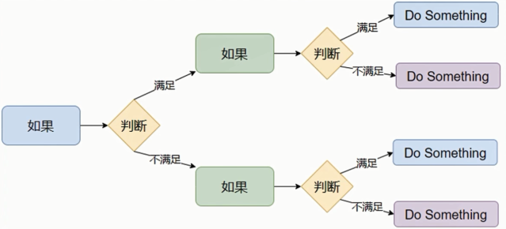

# 判断语句的嵌套使用


<!-- TOC -->
- [判断语句的嵌套使用](#判断语句的嵌套使用)
  - [语法格式](#语法格式)
  - [总结](#总结)

<!-- /TOC -->

有很多场景，不仅仅是多个并列条件，还会有满足前置条件才会二次判断的多层判断需求。


> 许多逻辑的判断，是嵌套的，多层次的。
> 
> 对于这种需求，我们可以：自由组合ifelifelse，完成特定需求的要求
## 语法格式
```py
if <条件1>：

<满足条件1做的事情1>
<满足条件1做的事情2>

    if <条件2>：

    <满足条件2做的事情1>
    <满足条件2做的事情2>
```
> 如上图，第二个if，属于第一个if内，只有第一个if满足条件，才会执行第二个if


>[!note]
> 嵌套的关键点，在于：空格缩进
> 
> 通过空格缩进，来决定语句之间的：层次关系

**示例**
```py
# 示例一
if int(input("请输入您的身高:")) >= 120:    # ①
    print("您的身高大于120cm,需要付费游玩")
    print("但是如果您的等级大于6级的话,可以免费游玩")

    if int(input("请输入您的等级:")) >= 6:  # ②
        print("您的等级大于6级,可以免费游玩")
    else:
        print("Sorry,您需要付费游玩")

else:
    print("您的身高小于120cm,可以免费游玩")

```
> 判断有 2层
>当外层if满足条件（编号1）时，才会执行内层if判断（编号2）
>当外层if（编号1）不满足，直接执行外层esle

**输出一:**
```
请输入您的身高:180
您的身高大于120cm,需要付费游玩
但是如果您的等级大于6级的话,可以免费游玩
请输入您的等级:7
您的等级大于6级,可以免费游玩
```
**输出二**
```
请输入您的身高:180
您的身高大于120cm,需要付费游玩
但是如果您的等级大于6级的话,可以免费游玩
请输入您的等级:2
Sorry,您需要付费游玩
```
**示例二:**
```py
# 示例二
age = int(input("请输入您的年龄:"))
time = int(input("输入你的入职时间:"))
level = int(input("请输入您的等级:"))

if age >= 18:
    print("OK,您是成年人,继续判断")

    if age < 30:
        print("您的年龄符合标准,继续判断")

        if time > 2:
            print("您的入职时间大于2年,您可以领取礼物")
        elif level >= 3:
            print("您的等级大于等于3级,您可以领取礼物")
        else:
            print("您的入职时间或等级不符合标准,不得领取礼物")
    else:
        print("您不符合标准,不得领取礼物")
else:
    print("您是未成年人,不得领取礼物")
```
~~屎山代码(dege)~~
**输出:**
```
请输入您的年龄:29
输入你的入职时间:1
请输入您的等级:4
OK,您是成年人,继续判断
您符合标准,继续判断
您的等级大于等于3级,您可以领取礼物
```
> if elif else 可以自由组合
> 
> 满足缩进的要求即可

## 总结
* 嵌套判断语句可以用于多条件、多层次的逻辑判断
* 嵌套判断语句可以根据需求，自由组合
* if elif else来构建多层次判断
* 嵌套判断语句，一定要注意空格缩进，Python通过空格缩进来决定层次关系
